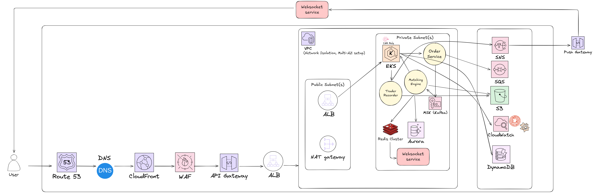

# High-Level Trading System Architecture

## Table of Contents

- [1. Architecture Overview](#1-architecture-overview)
- [2. Components Breakdown (and Why They Were Chosen)](#2-components-breakdown-and-why-they-were-chosen)
  - [1. User Entry Path](#1-user-entry-path)
  - [2. Core VPC Structure](#2-core-vpc-structure)
  - [3. Messaging and Data Stores](#3-messaging-and-data-stores)
  - [4. Endpoint Layer & Observability](#4-endpoint-layer--observability)
- [3. Data Flow Summary](#3-data-flow-summary)
- [4. Scalability Plans](#4-scalability-plans)
- [5. High Availability Measures](#5-high-availability-measures)
- [6. Security Best Practices](#6-security-best-practices)
- [7. Observability Stack](#7-observability-stack)
- [8. Why These AWS Services?](#8-why-these-aws-services)

This document describes a cloud-native, highly available trading platform inspired by Binance. It focuses on scalability, resilience, real-time messaging, and observability. The system is implemented on **AWS**, leveraging services such as EKS, MSK, Aurora, Redis, CloudFront, API Gateway, and more.

---

## 1. Architecture Overview

---

## 2. Components Breakdown (and Why They Were Chosen)

### 1. **User Entry Path**
- **Route 53**: Provides DNS-level routing. Chosen for its deep AWS integration, high availability, and routing policies (e.g. latency-based, geolocation).
- **CloudFront**: AWS’s CDN for caching static assets close to the user. Reduces latency and adds another layer of protection.
- **WAF**: Protects APIs from common threats (e.g. SQL injection, bot traffic). Easily integrated with CloudFront and API Gateway.
- **API Gateway**:
  - Handles authentication, throttling, and request transformation.
  - Supports both REST and WebSocket APIs.
  - Chosen for its auto-scaling and ease of integration with AWS Lambda/EKS.
- **ALB (Application Load Balancer)**:
  - Routes traffic to EKS services based on path or host rules.
  - Chosen for its layer 7 routing and native support for containerized environments.

### 2. **Core VPC Structure**
- **Amazon VPC**: Provides network isolation. Subnets split by public/private usage.
- **Public Subnet**:
  - **ALB**: Exposed to the internet.
  - **NAT Gateway**: Allows outbound internet access from private resources.
- **Private Subnet**:
  - **Amazon EKS**:
    - Manages Kubernetes workloads.
    - Chosen for its scalability, flexibility, and ability to deploy containerized microservices.
  - **Order Service**:
    - Validates, stores, and emits orders into the event stream.
    - Built in Go for performance.
  - **Matching Engine**:
    - Consumes Kafka events to match orders and generate trades.
    - Chosen to run on EKS for tight integration with other services.
  - **Trade Recorder**:
    - Logs trades to DB and file-based storage.
    - Ensures durability and compliance.
  - **WebSocket Service**:
    - Sends real-time market updates and trade notifications.
    - Placed outside VPC for latency optimization.

### 3. **Messaging and Data Stores**
- **Amazon MSK (Kafka)**:
  - Used as the event backbone for all asynchronous communication.
  - Provides persistence, ordering, and high throughput.
  - Alternatives considered: Amazon Kinesis (less flexible), RabbitMQ (less scalable).
- **Amazon Aurora (PostgreSQL)**:
  - Primary relational database for transactional data.
  - Chosen for its compatibility, performance, HA features (Multi-AZ, replicas).
  - Alternative: Amazon RDS (less scalable), DynamoDB (not ideal for relational joins).
- **Amazon ElastiCache (Redis)**:
  - Used for low-latency access to order book and price feed.
  - Supports Redis Pub/Sub for event propagation.
  - Alternative: Memcached (less suitable for persistence).

### 4. **Endpoint Layer & Observability**
- **Amazon SNS**:
  - Used for broadcasting trade fills, alerting systems, push notifications.
  - Supports multiple subscribers (email, SMS, Lambda).
- **Amazon SQS**:
  - Queues orders/events for later processing (e.g. clearing, settlement).
  - Durable, scalable, and decouples services.
- **Amazon S3**:
  - Central log and backup repository.
  - Used for exporting trade logs, snapshots.
- **Amazon CloudWatch**:
  - Aggregates logs, metrics, and alerts.
  - Essential for monitoring and auto-scaling triggers.
- **Amazon DynamoDB**:
  - Stores session data, user preferences, rate limits.
  - Chosen for low-latency reads and horizontal scalability.
- **Push Gateway + Prometheus**:
  - Collects custom app-level metrics.
  - Integrated with Grafana for dashboarding.
  - Chosen for observability beyond AWS-native tools.

---

## 3. Data Flow Summary

1. **User** accesses frontend → routed via Route53 → CloudFront → WAF → API Gateway → ALB.
2. ALB forwards request to **Order Service (EKS)**.
3. Order Service **publishes** order into **Kafka** (`orders-topic`).
4. **Matching Engine** consumes Kafka event, processes:
   - Writes to **Aurora** (confirmed trade)
   - Updates **Redis** (orderbook state)
   - Sends to **WebSocket Service** for live update
5. **Trade Recorder** logs completed trades.
6. Matching Engine pushes alerts to:
   - **SNS** (notifications)
   - **SQS** (queued consumers)
   - **S3** (storage)
   - **CloudWatch** (logs)
   - **Push Gateway** (UI notifications, webhooks)
7. **WebSocket Service** broadcasts updates to user frontend.

---

## 4. Scalability Plans

Scalability is crucial for a trading platform to handle traffic surges, market volatility, and peak-time transactions. Below are detailed strategies for scaling each component, along with real-world justifications and expected thresholds.

| **Component** | **Scale Strategy** | **Justification & Target Throughput** |
|--------------|--------------------|----------------------------------------|
| **Amazon EKS** | Horizontal Pod Autoscaler (HPA) based on CPU, memory, and custom metrics | Ensures responsive backend scaling during high order volumes. Each node group can scale up to 1000 pods. Metrics server and KEDA can extend HPA for queue-depth or latency triggers. |
| **Amazon MSK (Kafka)** | Partition sharding and broker autoscaling using Cruise Control | Supports over 1 million messages/sec with horizontal scaling across multiple brokers. Partition-based parallelism improves consumer throughput for order and trade events. |
| **ElastiCache (Redis)** | Redis Cluster with hash slot sharding and replica scaling | Enables sub-millisecond access to order books. Redis supports millions of ops/sec in clustered mode with automatic failover and replicas. |
| **Aurora PostgreSQL** | Aurora Serverless v2 + Read Replicas + Auto-scaling writer | Handles OLTP workloads with bursty reads/writes. Supports up to 15 read replicas with low-lag and 64 vCPUs per writer. Aurora Serverless v2 adds compute elasticity. |
| **WebSocket Service** | ECS on Fargate with NLB, scale based on connection count | WebSocket instances scale horizontally with millions of concurrent open connections. NLB can distribute load evenly without connection termination. |
| **API Gateway** | Fully managed auto-scaling with throttling policies | Supports thousands of RPS natively. Use throttling to protect backend systems, and caching to reduce repeat requests. CloudFront integration ensures CDN-level scale. |

These strategies ensure each tier of the system can scale independently, cost-efficiently, and reliably based on usage demand or market activity.

---

## 5. High Availability Measures
- **Multi-AZ** deployment for: Aurora, Redis, Kafka.
- **EKS nodes** span multiple subnets and AZs.
- ALB is zonally redundant.
- NAT Gateway deployed in at least two AZs.
- S3 and DynamoDB offer 99.999999999% durability.
- API Gateway and CloudFront are globally distributed.

---

## 6. Security Best Practices
- All sensitive services are in **Private Subnet**.
- Only ALB is internet-facing.
- **IAM Roles for Service Accounts (IRSA)** used in EKS.
- **WAF** for protection against malicious input.
- **VPC Interface Endpoints** limit traffic to AWS services.
- Secrets stored in **AWS Secrets Manager** (not shown).
- S3 buckets configured with encryption and access policies.

---

## 7. Observability Stack
- **CloudWatch**:
  - Aggregates application and infrastructure logs.
  - Triggers alerts and autoscaling actions.
- **Prometheus + PushGateway**:
  - Captures app metrics (order latency, trades/sec).
  - Custom Grafana dashboards for frontend visibility.
- **Trace support** (optional): AWS X-Ray or OpenTelemetry.

---

## 8. Why These AWS Services?

This section elaborates on the reasoning behind choosing specific AWS services, including the benefits they provide and why they are particularly suited for a trading platform that prioritizes scalability, resilience, and performance.

| **Service** | **Why It Was Chosen** | **Alternatives Considered** |
|-------------|------------------------|------------------------------|
| **Amazon EKS** | Provides powerful Kubernetes orchestration, enabling microservice architecture, autoscaling, and seamless integration with monitoring and security. Ideal for teams already comfortable with containers. | AWS ECS (simpler but less flexible), AWS Lambda (limited for long-running or stateful workloads) |
| **Amazon MSK (Kafka)** | Acts as the event streaming backbone to decouple services and maintain order/event processing guarantees. Perfect for matching engines and trade logs. | Amazon Kinesis (less flexible protocol), RabbitMQ (less performant and scalable) |
| **Amazon ElastiCache (Redis)** | Offers fast, low-latency access to real-time data like order books and price feeds, and supports Pub/Sub for push updates to WebSocket services. | Memcached (no persistence, no Pub/Sub) |
| **Amazon Aurora (PostgreSQL)** | A fully managed, high-performance relational database that supports complex queries and transactional integrity, with Multi-AZ and auto-scaling support. | Amazon RDS (less scalable), DynamoDB (NoSQL, not ideal for relational or transactional logic) |
| **Amazon API Gateway** | Easily manages REST and WebSocket APIs with support for throttling, authentication, and monitoring. Provides global scalability and fine-grained request control. | ALB (only suitable for HTTP-based routing, lacks built-in auth and throttling) |
| **Amazon CloudFront** | Serves static and dynamic content with low latency via global edge locations. Enhances user experience and provides an additional security layer when used with WAF. | Cloudflare (external solution), custom CDN (requires more configuration and maintenance) |
| **Amazon S3** | Highly durable object storage ideal for storing logs, trade exports, backups, and market snapshots. Supports versioning and encryption. | EFS (for shared file systems), FSx (for Windows or Lustre-based workloads) |
| **Amazon CloudWatch** | Native AWS logging and monitoring tool that integrates well with EKS, Lambda, and networking. Provides metrics, alarms, and log insights in one platform. | Prometheus (requires manual setup in AWS), Datadog (external, costlier for high-volume logs) |
| **Amazon SNS / SQS** | SNS handles pub/sub notifications (e.g., trade confirmations), while SQS ensures asynchronous processing of messages between services. Highly reliable and scalable. | EventBridge (more rule-driven, less decoupling), Step Functions (orchestration-focused) |

Each service was selected based on production-grade trade-offs between scalability, performance, ecosystem fit, cost, and maintenance complexity. These choices collectively support a high-performance, resilient, and secure trading system.

